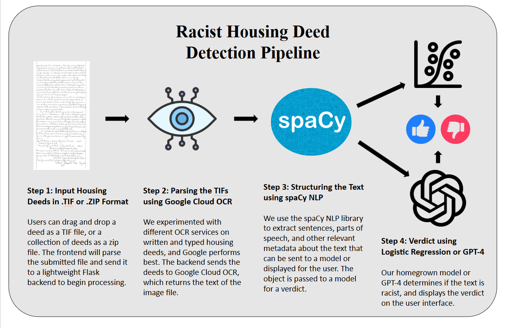
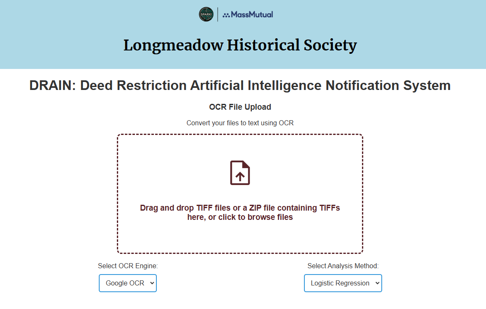

# Note on Documentation

There are 3 semesters-worth of documentation in this repository. For Spring and Summer 2024, please see S24-SUM24-Docs.md. This README.md contains Fall 2024 documentation, which builds upon and incorporates work from previous semesters. You can safely skip the old documentation, we have incorporated necessary components.

# DRAINS Racism Detection Pipeline - Fall 2024
SPARK! x MassMutual Data Days for Good

Created by Nathaniel Quisel, Jacob Stein, Jianying Liu

## Project Overview
The Racist Deeds Project aims to expand the identification of property deeds with racist restrictions, initially focusing on Longmeadow, Massachusetts. These restrictions, targeting marginalized groups like African Americans, were outlawed by the Fair Housing Act of 1968 and locally in Massachusetts by 1946. This project seeks to streamline the identification process of discriminatory deeds to support the Longmeadow Historical Society.

The focus of this semester was to build a data pipeline that will interact with deeds stored in a designated Google Drive location and potentially adjust some of the Gen AI prompts. The project implements Optical Character Recognition (OCR) tools to digitize and extract text from scanned deed documents, which facilitates more efficient analysis and pattern recognition.

This project, developed for the [Longmeadow Historical Society](https://www.longmeadowhistoricalsociety.org), introduces an automated tool designed to identify racist restrictions within historical property deeds. Utilizing advanced text analysis techniques, the program processes TIFF images of property deeds, evaluates the text for racist content, and extracts critical information—specifically the deed date and page number—into a CSV format for efficient access and analysis.

## Data Pipeline

See below a diagram of the data pipeline



The pipeline is split into several key phases, facilitated by separate modules:
- OCR: We used Google OCR to turn scanned deed TIFF files into a string
- Structure: We used spaCy NLP to turn the string into a structured object with metadata like parts of speech and sentence breakdown
- Classification: Users can choose between logistic regression or ChatGPT to make a classification of submitted deeds, which will display the result on the UI

There is more detailed documentation in the modules folder about how each component is connected. Here is a code snippet from app.py containing the combined modules:

```python
if ocr_engine == 'google':
            # Step 1: Get text using Google OCR
            google_text = google_cloud_ocr(file)

            # Step 2: Pass text through the spell checker
            spellchecked_text = correct_spelling(google_text)

            # Step 3: Pass text through the preprocessor
            processed_text = preprocess_text(spellchecked_text)

            # Extract book and page numbers right after spellchecking
            book_numbers, page_numbers = extract_book_and_page(spellchecked_text)

            # Step 4: Get the names and locations
            extracted_info = {
                "names": processed_text.get("names", []),
                "locations": processed_text.get("locations", []),
                "book_numbers": book_numbers,  
                "page_numbers": page_numbers
            }
            
            # Step 5: Choose analysis method
            if analysis_method == 'chatgpt':
                analysis_result = racist_chatgpt_analysis(processed_text['original_text'])
                return jsonify({
                    'status': 'success',
                    'ocr_engine': 'google',
                    'analysis_method': 'chatgpt',
                    'original_text': google_text,
                    'spellchecked_text': spellchecked_text,
                    'processed_text': processed_text,
                    'extracted_info': extracted_info,
                    'result': analysis_result
                }), 200
            elif analysis_method == 'logistic_regression':
                lr_result = predict(processed_text, vectorizer, logistic_model)['is_racist']
                return jsonify({
                    'status': 'success',
                    'ocr_engine': 'google',
                    'analysis_method': 'logistic_regression',
                    'original_text': google_text,
                    'spellchecked_text': spellchecked_text,
                    'processed_text': processed_text,
                    'extracted_info': extracted_info,
                    'result': lr_result
                }), 200
            else:
                return jsonify({'error': 'Unsupported analysis method selected'}), 400
```

- Step 1: Uses google_cloud_ocr from google_cloud_ocr module
- Step 2: Uses correct_spelling from deed_preprocessing module
- Step 3: Uses spaCy preprocessor from deed_preprocessing module
- Step 4: Extracts names and locations using preprocessed data
- Step 5: Use predict from BoW-LR module, or make a GPT-40-mini call using our OpenAI module

## Frontend Application (DRAINS)

The Spring 2024 group built a frontend called DRAINS which handles receiving and sending TIFFs to the backend. Below is a screenshot of the UI:



We augmented the UI by adding bulk-uploading and dropdowns to select OCR and classification type.

The function handleFileUpload in App.jsx is responsible for hitting the backend on HuggingFace:

```javascript
const handleFileUpload = async (files) => {
    setResults([]);
    setIsLoading(true);

    try {
      const newResults = [];
      for (const file of files) {
        const formData = new FormData();
        formData.append("file", file);
        formData.append("ocr_engine", ocrEngine);
        formData.append("analysis_method", analysisMethod);

        // Reads from HuggingFace backend
        const response = await fetch(
          "https://spark-ds549-f24-racist-deeds.hf.space/api/upload",
          {
            method: "POST",
            body: formData,
          }
        );

        if (!response.ok) {
          throw new Error(`HTTP error! status: ${response.status}`);
        }

        const data = await response.json();

        newResults.push({
          fileName: file.name,
          spellcheckedText: data.spellchecked_text || "No text available",
          analysisResult: data.result || false,
          extractedInfo: data.extracted_info || { names: [], locations: [] },
        });
      }
      setResults(newResults);
      setSelectedResult("all");
    } catch (error) {
      console.error("Error during fetch:", error);
    } finally {
      setIsLoading(false);
    }
  };
  ```

## Deployment

Both the frontend and backend need to be deployed separately.

The backend is deployed on a space in BU Spark!'s HuggingFace organization. Here are relevant links:

- BU Spark! HuggingFace organization: https://huggingface.co/spark-ds549
- HuggingFace deployment repo: https://huggingface.co/spaces/spark-ds549/F24-Racist-Deeds/tree/main
- GET endpoint for checking backend health: https://spark-ds549-f24-racist-deeds.hf.space/api/health

The backend is just a containerized Flask application. To make changes, clone the repo at the second link and make changes. The backend requires three ENV variables to use the Google Cloud OCR and OpenAI API. You can go under settings in the space to see these ENV variables. Currently, BU Spark!'s OpenAI and Google OCR keys are being used, but they can be changed at any time.

The frontend is deployed under Jacob's personal Vercel (web-hosting service) account. To make a new frontend deployment, make a Vercel account, and fork the ml-longfellow-land-use repo. Connect Vercel to your GitHub, and select the branch you want to deploy.

Our final deployment can be found here: https://ml-longfellow-land-use-mass.vercel.app/

## Modules

Each module has its own documentation in its respective sub-directory. Run ```pip install -r requirements.txt``` before testing any modules to ensure you have the needed packages. Below is a quick summary of each module

- azure_cloud_ocr: Used to test Microsoft Azure OCR, which was ultimately not used
- data_retrieval: Used to fetch deeds from Google Cloud locally
- deed_preprocessing: Used to read TIFFs from the SCC and structure the objects using spaCy and autocorrect
- google_cloud_ocr: Used for Google Cloud OCR, which is used in the pipeline
- last_year: Contains unused modules from S24
- model_experimentation: Contains code used to create dataframes from spaCy objects and test on BoW-LR model
- models: Contains A pickled LR and word vectorizer model
- openai: Contains Contains code used to call OpenAI API
- synthetic_data: Contains code used to create synthetically-racist deeds by injecting racist covenant clauses from other datasets

## Quickstart

### Frontend

- Open a terminal and navigate to drain/
- Run ```npm install``` to install needed node modules
- Change the backend URL on Line 6 of App.jsx
    ```javascript
    const BACKEND_URL = "https://spark-ds549-f24-racist-deeds.hf.space"
    ```
    Change to:
    ```javascript
    const BACKEND_URL = "http://localhost:5000"
    ```
    Replace port 5000 with whatever port you want to use for the backend

- Run ```npm run dev``` to start the vite application
- Visit  http://localhost:5173/ in your browswer, and you should see the UI

### Backend

- Install requirements using ```pip install -r requirements.txt```
- Install required spaCy model using ```python -m spacy download en_core_web_sm```
- Add the following ENV variables:
    - GOOGLE_CLOUD_CREDENTIALS: path to BU Spark!'s Google Cloud credentials

    The Google Cloud credentials JSON must be of the form:

    ```json
    {
    "type": "",
    "project_id": "",
    "private_key_id": "",
    "private_key": "",
    "client_email": "",
    "client_id": "",
    "auth_uri": "",
    "token_uri": "",
    "auth_provider_x509_cert_url": "",
    "client_x509_cert_url": "",
    "universe_domain": ""
    }
    ```
    To get this JSON, log into Google Cloud Console under the project of choice, and go IAM & Admin > Service Accounts. Make a service account or click the three vertical dots next to an existing one and click manage keys. Add a new key and download the JSON.

    Rename the JSON to google-cloud.json and put it at /credentials/google-cloud.json. Set the path as follows in the .env file

    GOOGLE_APPLICATION_CREDENTIALS=/credentials/google-cloud.json

    For more precise details on setting up Google Cloud credentials, see the README.md in ./modules/google_cloud_ocr

    - OPENAI_ORG_ID: BU Spark!'s OpenAI organization ID, get from BU Spark!
    - OPENAI_API_KEY: BU Spark!'s OpenAI API key, get from BU Spark!
    - Make a .env file in root directory to set the three above variables
- Run ```python3 app.py```

Your frontend and backend should now be running on two separate ports!